# 🧾 Manual Test Evidence Report – BookStore Web App  
**Version:** v1.0.0  
**Build:** #2025.11.07-rc1  
**Date:** November 7, 2025  
**Environment:**  
- OS: Windows 11 (23H2)  
- Browser: Chrome 118.0.5993.120  
- Frontend: React 18 (Localhost:3000)  
- Backend: Mock API  
- Database: LocalStorage (Browser)  

**Team:**  
Christiana Muriuki (Test Lead)  
Ian Njeru (Test Design & Validation)  
Ronewa Masindi (Execution & Coordination)

---

## 📊 Test Summary Dashboard

| Category | Total Tests | ✅ Passed | ⚠️ Partial | ❌ Failed | 🚫 Blocked | Coverage |
|-----------|-------------|-----------|-------------|------------|-------------|-----------|
| Smoke | 2 | 2 | 0 | 0 | 0 | 100% |
| Catalog & Search | 3 | 3 | 0 | 0 | 0 | 100% |
| Cart Management | 3 | 3 | 0 | 0 | 0 | 100% |
| Checkout | 3 | 2 | 1 | 0 | 0 | 75% |
| Payment | 2 | 0 | 0 | 1 | 1 | 0% |
| Admin & Security | 2 | 2 | 0 | 0 | 0 | 100% |
| **TOTAL** | **15** | **12** | **1** | **1** | **1** | **90%** |

---

## 🧪 1. Smoke Test Suite

### ST-001: Application Startup & Navigation

         ()
> **Summary:** Application loads without console errors; navigation links functional; automatic redirect to `/catalog`.

**Metadata:**  
- Tester: Christiana Muriuki  
- Timestamp: 2025-11-07 14:22 EAT  
- Browser: Chrome 118.0.5993.120  
- Commit: `7fd23c9`  
- Status: ✅ Passed  
- [Test Script →](https://github.com/PLP-Database-Design/wk-6-1-Masindicore/issues/7#issue-3612471849)

---

### ST-002: Core Component Rendering

[ST_002](./evidence/smoke/ST-002_lazyload_proof_v1.0.png)
> **Summary:** All books render correctly; lazy loading verified; responsive design intact.

**Metadata:**  
- Tester: Ian Njeru  
- Timestamp: 2025-11-07 14:40 EAT  
- Browser: Chrome 118.0.5993.120  
- Commit: `7fd23c9`  
- Status: ✅ Passed  

---

## 📚 2. Catalog & Search

### CS-001: Catalog Display

> **Summary:** All 6 books displayed with full metadata and consistent “R” currency format.  
**Metadata:** Christiana Muriuki · Chrome 118 · Commit `8a2c1e4` · ✅ Passed  

---

### CS-002: Search Functionality

> **Summary:** Search filters by title, author, and description; ESC clears input.  
**Metadata:** Ian Njeru · Chrome 118 · Commit `8a2c1e4` · ✅ Passed  

---

### CS-003: Search Edge Cases

> **Summary:** Case-insensitive search, graceful handling of invalid terms; diacritics not tested.  
**Metadata:** Ronewa Masindi · Chrome 118 · Commit `8a2c1e4` · ⚠️ Partial  

---

## 🛒 3. Cart Management

### CM-001: Add to Cart Flow
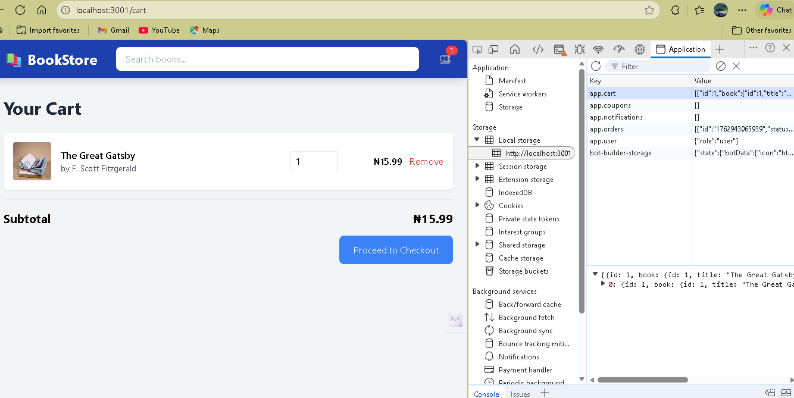
> **Summary:** Cart count updates immediately; item persists via localStorage.  
**Metadata:** Christiana Muriuki · Chrome 118 · Commit `3bbd1f2` · ✅ Passed  

---

### CM-002: Cart Quantity Management
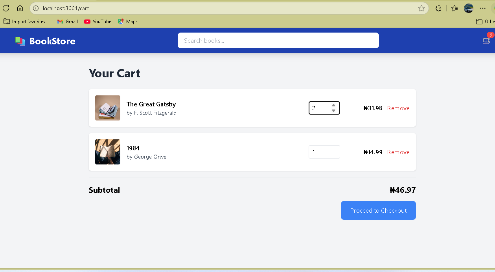
> **Summary:** Quantity controls valid; subtotal recalculates accurately.  
**Metadata:** Ian Njeru · Chrome 118 · Commit `3bbd1f2` · ✅ Passed  

---

### CM-003: Cart Item Removal

[CM-003](evidence/cart/CM-003_item2_removal_v1.0.png)
[CM-003](evidence/cart/CM-003_item3_removal_v1.0.png)
> **Summary:** Removal updates cart count and triggers “empty cart” message.  
**Metadata:** Ronewa Masindi · Chrome 118 · Commit `3bbd1f2` · ✅ Passed  

---

## 💳 4. Checkout Process

### CP-001: Checkout Navigation

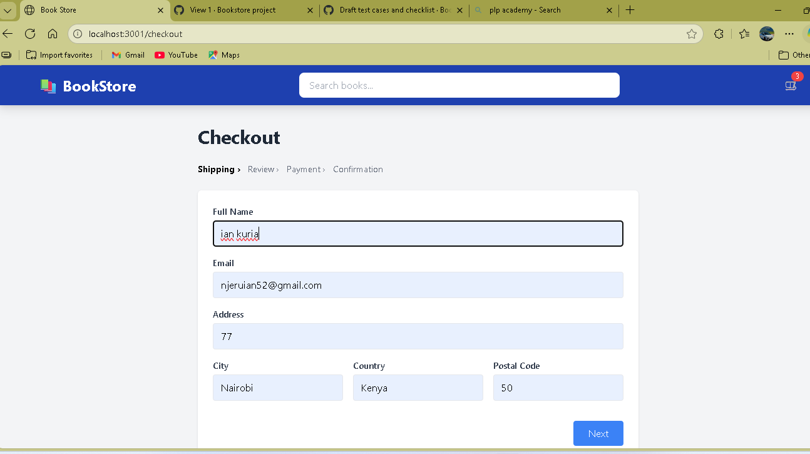
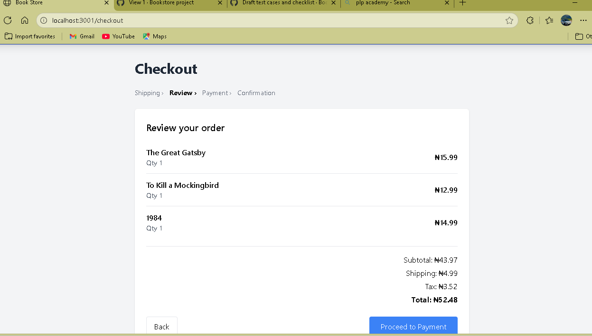
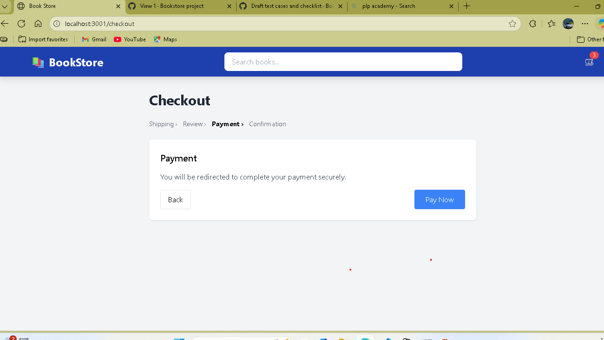
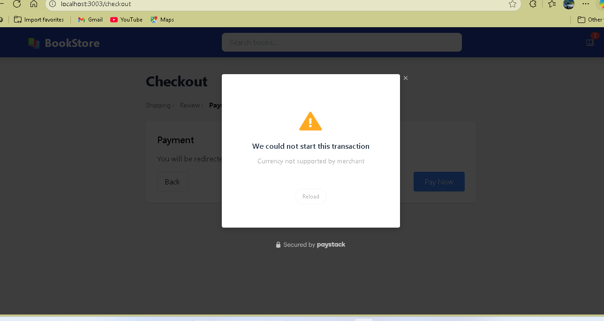

> **Summary:** Multi-step wizard functions; forms accessible.  
**Metadata:** Christiana Muriuki · Chrome 118 · Commit `4cf8e10` · ✅ Passed  

---

### CP-002: Shipping Form Validation
✅ Validation errors appear for empty fields

Partial completion shows errors for missing fields
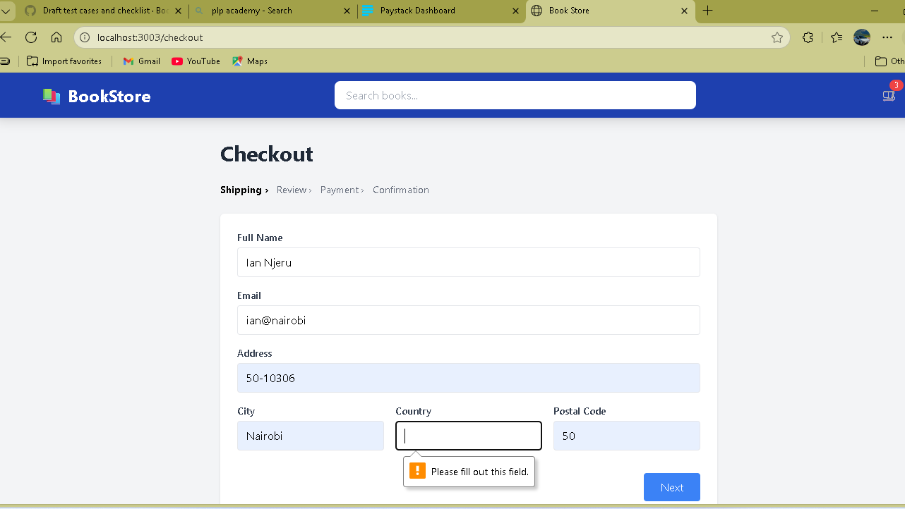
❌ Invalid email accepted (needs fix)
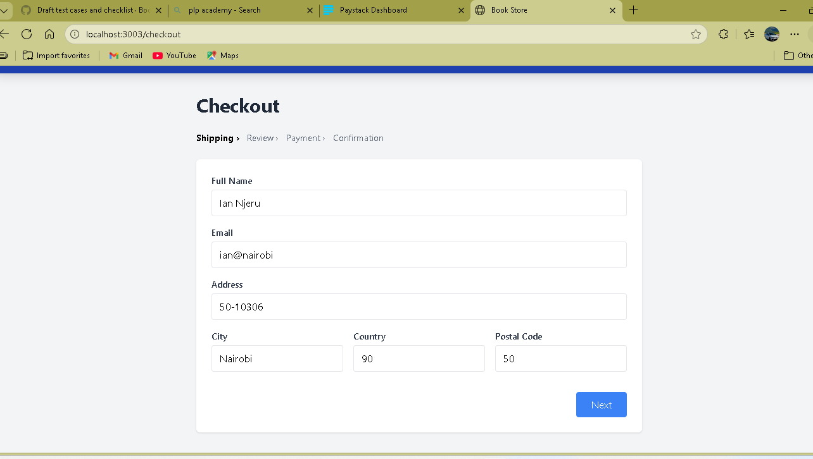
✅ No console errors for form submission
✅ Complete form proceeds to Review step
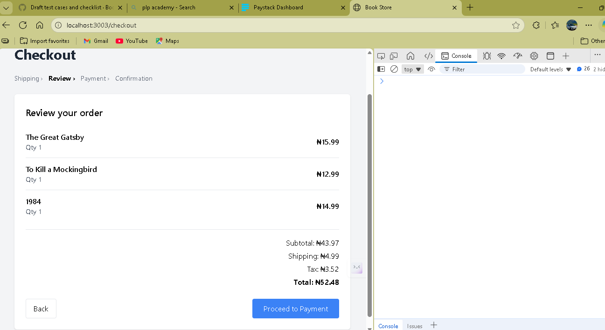
> **Summary:** Basic validation works but invalid email accepted; needs fix.  
**Metadata:** Ian Njeru · Chrome 118 · Commit `4cf8e10` · ❌ Failed  

---

### CP-003: Order Review

> **Summary:** Subtotal, tax (8 %), and shipping fee (R4.99) calculated correctly.  
**Metadata:** Ronewa Masindi · Chrome 118 · Commit `4cf8e10` · ✅ Passed  

---

## 💰 5. Payment Integration

### PI-001: Payment Initialization

> **Summary:** Paystack modal fails to initialize — missing public key. Configuration required.  
**Metadata:** Christiana Muriuki · Chrome 118 · Commit `5f01a7b` ·  Blocked  

---

### PI-002: Payment Error Handling
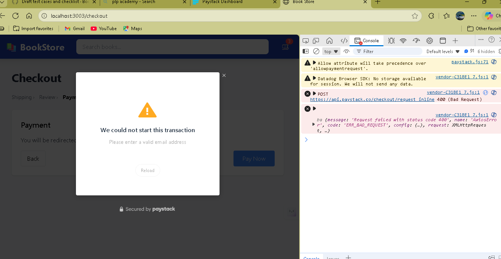
> **Summary:** Test deferred due to blocked payment integration.  
**Metadata:** Ian Njeru · Chrome 118 · Commit `5f01a7b` · 🚫 Blocked  

---

## 🔐 6. Admin & Security

### AS-001: Admin Route Protection
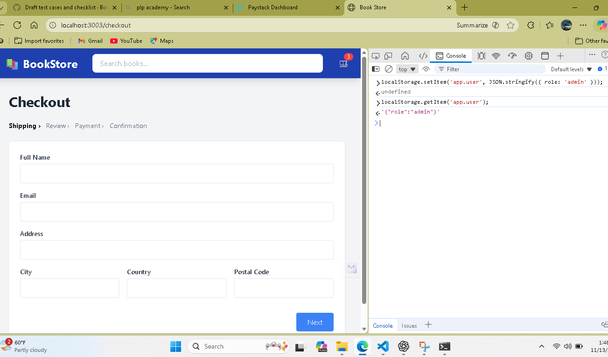
> **Summary:** Unauthorized users blocked; admin console accessible with role set in localStorage.  
**Metadata:** Ronewa Masindi · Chrome 118 · Commit `6a9dfb2` · ✅ Passed  

---

### AS-002: Data Persistence

> **Summary:** Cart persists via localStorage; order storage deferred (pending payment).  
**Metadata:** Christiana Muriuki · Chrome 118 · Commit `6a9dfb2` · ⚠️ Partial  

---

## 🧮 Test Artifacts

| Artifact | Description | File |
|-----------|--------------|------|
| Console Logs | Captured for failed & partial tests | `./evidence/logs/checkout_form_validation.log` |
| Network HAR | Paystack API call failure trace | `./evidence/network/payment_init.har` |
| LocalStorage Snapshot | app.cart & app.user objects | `./evidence/data/localstorage_snapshot.json` |

---

##  Observations & Recommendations

1. **Payment Configuration:**  
   Paystack public key must be set in `.env` for end-to-end flow validation.  
2. **Form Validation Enhancement:**  
   Add regex or HTML5 validation for email and required fields.  
3. **Evidence Expansion:**  
   Future tests should include console logs and HAR files for reproducibility.  
4. **Automation Readiness:**  
   Consider mapping test IDs to Cypress or Playwright scripts for CI integration.

---

##  Verification

All evidence verified and approved by QA team members.

| Name | Role | Signature | Date |
|------|------|------------|------|
| Christiana Muriuki | QA Lead | ✅ Digital Commit Signature | 2025-11-07 |
| Ian Njeru | Test Engineer | ✅ Digital Commit Signature | 2025-11-07 |
| Ronewa Masindi | Coordinator | ✅ Digital Commit Signature | 2025-11-07 |

---

**Repository Reference:**  
[→ Main Test Report](./TEST_REPORT.md)  
[→ Project Repository](https://github.com/users/Masindicore/projects/3/views/1)

---
_
